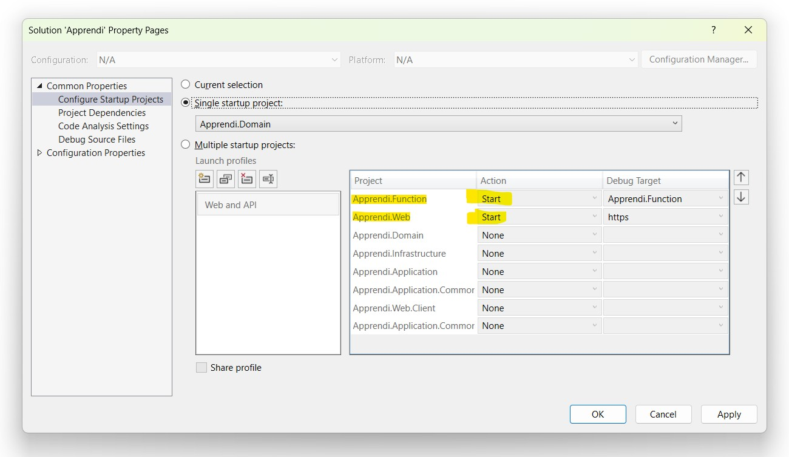

# Apprendi

Create a file called ```local.settings.json``` and place it the same directory as ```Apprendi.Function.csprof```

If needed, change the database connection string to work on for your machine

``` json
{
  "IsEncrypted": false,
  "Values": {
    "AzureWebJobsStorage": "UseDevelopmentStorage=true",
    "FUNCTIONS_WORKER_RUNTIME": "dotnet-isolated",
    "ConnectionStrings:DefaultConnection": "Server=.;Database=ApprendiDbContext;Trusted_Connection=True;TrustServerCertificate=True;"
  },
  "Host": {
    "CORS": "https://localhost:7120"
  }
}
```


# Configure Startup Projects.

Set both ```Apprendi.Function``` and ```Apprendi.Web``` projects to start up.


